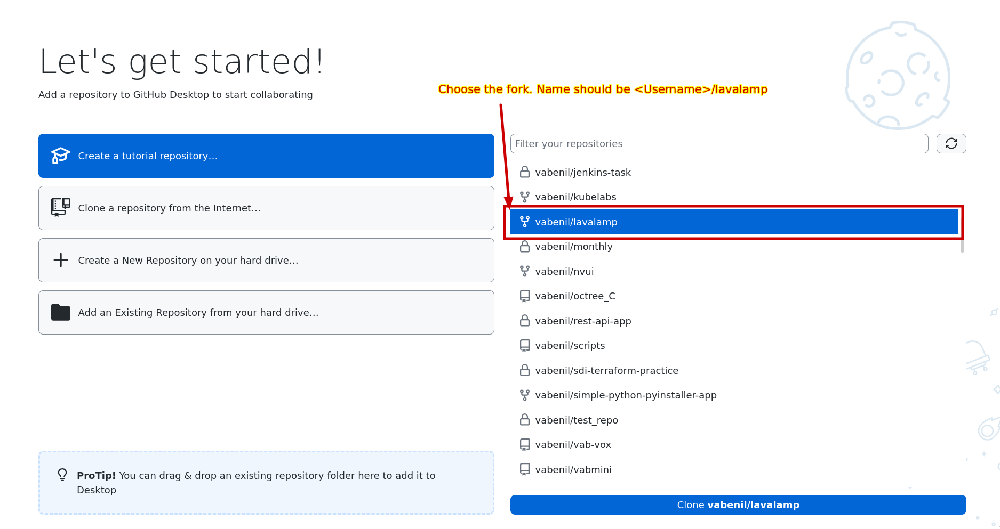
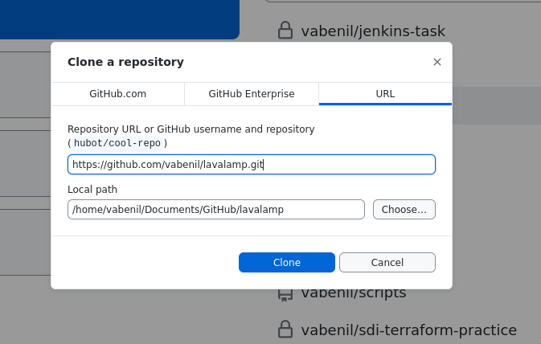
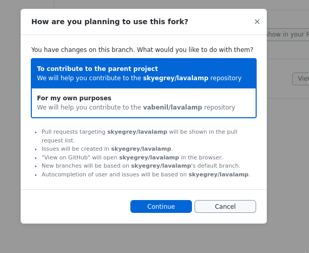

## Install Github desktop
## Log in with your Github account
## Choose the repo to clone
- Choose the repo we are gonna work on. The name of the repo should be
`[github username]/lavalamp`.
- Lastly click the button *"Clone [github username]/lavalamp"*

***REMEMBER***: Don't clone *`skyegrey/lavalamp` only your own fork!!!

## Clone repo
Here we are going to clone the repo

- Validate that your repo URL ends with
`[github user name]/lavalamp.git`

- **[Optionally]** you can modify where your local copy of the repo will be
    on. The default should be fine
- Click *Clone*
***NOTE:*** In Windows your path is gonna look like: `C:\path\to\file`

- Next just click continue

## Project successfully set up!
Nice! You got your fork! Now let's learn how to use Github Desktop!

## Current Repo
TBD
## Current branch
TBD
## Last fetch
TBD
## Changes
TBD
## History
TBD
## 
